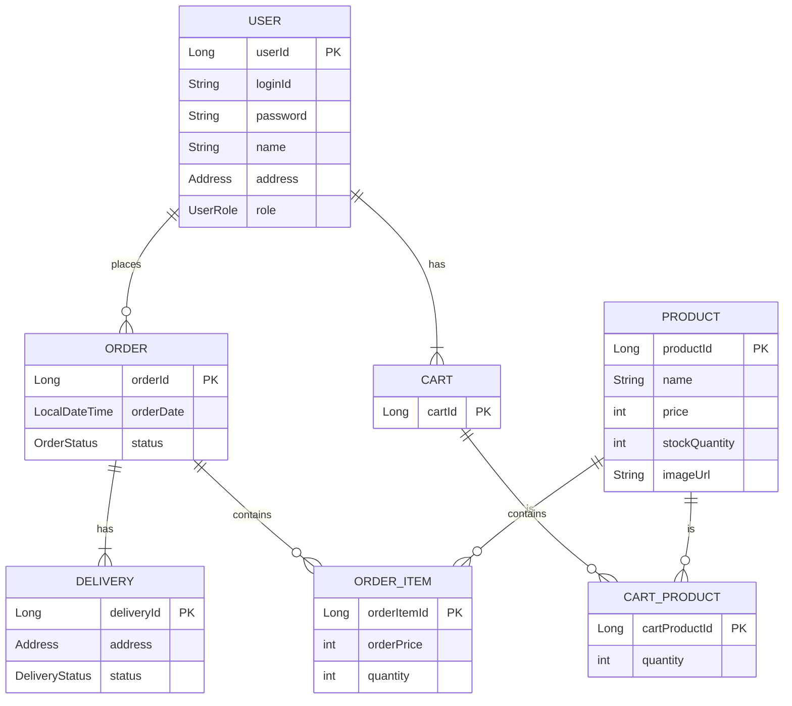

# Hanaro Shopping Mall Project

하나로(Hanaro) 쇼핑몰 백엔드 API 프로젝트입니다. Spring Boot와 JPA를 기반으로 사용자, 상품, 주문, 인증 등 쇼핑몰의 핵심 기능을 구현했습니다.

## ✨ 주요 기능

- **사용자**: 회원가입, 로그인(JWT), 토큰 재발급, 로그아웃
- **상품**: 상품 등록, 조회, 검색, 수정, 삭제
- **장바구니**: 상품 추가, 조회, 수량 변경, 삭제
- **주문**: 장바구니 상품으로 주문 생성, 주문 목록/상세 조회, 주문 취소
- **관리자**: 회원 및 상품 관리, 주문 내역 검색, 매출 통계 조회
- **배치**: 일일 매출 통계 집계 (매일 00시 실행)
- **스케줄러**: 주문 상태 자동 변경 (결제완료 → 배송준비중 → 배송중 → 배송완료)

## 📚 기술 스택

- **언어**: Java 17
- **프레임워크**: Spring Boot 3.x, Spring Security, Spring Batch
- **데이터베이스**: MySQL, JPA (Hibernate)
- **인증**: JWT (JSON Web Token)
- **API 문서**: Springdoc (Swagger UI)
- **빌드 도구**: Gradle
- **기타**: Lombok, Querydsl, Actuator

## 📝 API 명세

전체 API 명세는 애플리케이션 실행 후 아래 Swagger UI 주소에서 확인하고 직접 테스트해볼 수 있습니다.

- **Swagger UI**: [http://localhost:8080/swagger-ui/index.html](http://localhost:8080/swagger-ui/index.html)

Swagger UI 우측 상단의 드롭다운 메뉴를 통해 **Public, User, Admin API 그룹**을 선택하여 볼 수 있습니다.

| 기능 | HTTP Method | URL | 설명 |
| --- | --- | --- | --- |
| **회원 가입** | `POST` | `/api/users/signup` | 새로운 사용자를 등록합니다. |
| **로그인** | `POST` | `/api/users/login` | 로그인 성공 시 Access/Refresh Token을 발급합니다. |
| **토큰 재발급** | `POST` | `/api/users/reissue` | Refresh Token으로 새로운 Access Token을 재발급합니다. |
| **전체 상품 조회** | `GET` | `/api/products` | 판매 중인 모든 상품 목록을 페이징하여 조회합니다. |
| **상품 상세 조회** | `GET` | `/api/products/{productId}` | 특정 상품의 상세 정보를 조회합니다. |
| **장바구니 상품 추가** | `POST` | `/api/user/cart/products` | 장바구니에 상품을 추가합니다. (USER 권한) |
| **내 장바구니 조회** | `GET` | `/api/user/cart` | 현재 사용자의 장바구니 정보를 조회합니다. (USER 권한) |
| **주문 생성** | `POST` | `/api/user/orders/from-cart` | 장바구니의 모든 상품으로 주문을 생성합니다. (USER 권한) |
| **내 주문 목록 조회**| `GET` | `/api/user/orders` | 현재 사용자의 주문 목록을 페이징하여 조회합니다. (USER 권한) |
| **상품 등록** | `POST` | `/api/admin/products` | 새 상품을 등록합니다. (ADMIN 권한) |
| **전체 회원 조회** | `GET` | `/api/admin/users` | 모든 사용자 목록을 조회합니다. (ADMIN 권한) |
| **매출 통계 조회** | `GET` | `/api/admin/sales` | 지정된 기간의 일별 매출을 조회합니다. (ADMIN 권한) |
| *... (기타 API는 Swagger UI 참고)* | | | |

## 📦 프로젝트 구조

```
src
├── main
│   ├── java/shoppingmall/hanaro
│   │   ├── config      # Security, Swagger, Batch 등 설정 클래스
│   │   ├── controller  # API 엔드포인트를 담당하는 컨트롤러
│   │   ├── domain      # JPA 엔티티 클래스
│   │   ├── dto         # 데이터 전송 객체 (Data Transfer Object)
│   │   ├── exception   # 사용자 정의 예외 및 핸들러
│   │   ├── repository  # JPA Repository 및 Querydsl 구현체
│   │   ├── service     # 비즈니스 로직을 처리하는 서비스
│   │   └── util        # JWT 관련 유틸리티 클래스
│   └── resources
│       ├── data.sql    # 서버 실행 시 초기 데이터 주입
│       └── logback-spring.xml # 로그 설정
└── test
    └── java/shoppingmall/hanaro
        ├── controller  # 컨트롤러 통합 테스트
        └── service     # 서비스 및 배치 테스트
```

## 📉 ERD (Entity Relationship Diagram)



## 🚀 실행 및 테스트

### 실행 방법

1.  **데이터베이스 설정**:
    - MySQL 서버에 `hanarodb` 스키마를 생성합니다.
    - `src/main/resources/application.properties` 파일의 `spring.datasource` 관련 설정을 자신의 로컬 DB 환경에 맞게 수정합니다.

2.  **애플리케이션 실행**:
    - 프로젝트를 IDE로 열고 `HanaroApplication.java` 파일을 실행합니다.
    - 또는, 터미널에서 프로젝트 루트 디렉토리로 이동 후 아래 명령어를 실행합니다.
      ```bash
      ./gradlew bootRun
      ```

### 테스트 방법

프로젝트에 작성된 모든 테스트 코드를 실행하려면 터미널에서 아래 명령어를 입력합니다.

```bash
./gradlew test
```

테스트 실행 후 결과 리포트는 `build/reports/tests/test/index.html`에서 확인할 수 있습니다.
